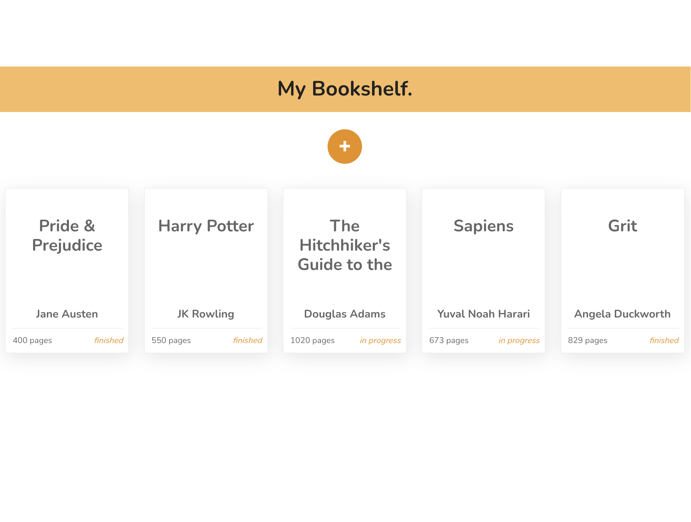

# *My Bookshelf.* Virtual Bookshelf
*My Bookshelf.* is a virtual bookshelf web-app that allows users to store a digital version of their bookshelves and can also be utilized as a reading list. This project was built to demonstrate understanding and use of JavaScript classes for object creation and localStorage methods.

:star: [Live Demo](https://kuosandys.github.io/virtual-bookshelf/) :star:

## Features
The books are displayed on a modern and minimalist interface that is both easy to read and use. A pop-up form allows users to add books by inputting the title, author, number of pages, and reading status. Each book can be removed from the shelf simply by clicking on the trashcan icon that shows on hover/focus over each book. The reading status can also be easily toggled by clicking on the reading status display on each book, as indicated by the pointer cursor.

The bookshelf is stored locally on the user's web browser, so they can return to their shelf at any time.

## Technologies
- JavaScript (Vanilla)
- CSS
- Sass
- HTML

## Sources
This project was built as part of The Odin Project's JavaScript Curriculum. Project guidelines can be found [here](https://www.theodinproject.com/courses/javascript/lessons/library).